# **OrchestrAI**  
### *AI‑Driven SDLC Orchestrator — From Intent → Requirements → Jira → Pull Requests*

OrchestrAI is an end‑to‑end **AI SDLC automation platform** that transforms raw user intent into fully structured requirements, Jira tickets, and production‑ready pull requests — all with minimal human intervention and enterprise‑grade guardrails.

It eliminates the need for prompt writing, reduces manual overhead, and ensures consistent, high‑quality engineering workflows across Business Users, Product Owners, and Developers.

---

# 🚀 **Key Features**

## **1. Multi‑Role AI Workflow**
OrchestrAI supports four primary user roles:

- **Business User** — submits requests (Bug, Feature, New App)  
- **Product Owner** — reviews, uploads supporting documents, approves Jira creation  
- **Developer** — reviews AI‑generated PRs  
- **Admin** — configures templates, rules, document formats, and guardrails  

Each role has a dedicated dashboard and workflow.

---

# 📝 **2. Business User Request Intake**
Business Users can submit new requests through a simple guided flow:

### **Flow**
1. Click **“I have a request”**  
2. Choose **Bug**, **Feature**, or **New App**  
3. OrchestrAI automatically pulls **all GitHub repos** in the organization  
4. User selects the relevant repo from a dropdown  
5. User provides a short description  
6. AI conducts an **interactive interview** to gather missing details  
7. AI generates a **Jira‑ready ticket summary**  
8. User reviews and approves  

All requests become visible in both the **Business User Dashboard** and **Product Owner Dashboard**.

---

# 🧠 **3. AI‑Driven Requirement Refinement**
OrchestrAI uses a multi‑agent AI system to:

- Ask clarifying questions  
- Identify missing details  
- Analyze the selected GitHub repo  
- Understand impacted modules  
- Extract entities and relationships  
- Generate structured requirements  

This ensures every request is complete, consistent, and actionable.

---

# 📄 **4. Product Owner Review + Document Generation**
Product Owners can:

- Review the AI‑generated ticket  
- Upload **any supporting files**, including:
  - Meeting transcripts  
  - Technical design documents  
  - ERDs  
  - Architecture notes  
  - Screenshots  
  - Voice‑to‑text transcripts  

OrchestrAI analyzes both the **repo** and the **uploaded documents** to generate:

- BRD  
- URS  
- FRS  
- Acceptance Criteria  
- Impact Analysis  
- Technical Notes  

All document formats are **fully configurable** via the Admin panel.

---

# 🧩 **5. Configurable Templates & Guardrails**
Admins can define:

- Document templates (Markdown, DOCX, JSON schema)  
- Required fields  
- Validation rules  
- Jira mapping rules  
- AI behavior constraints  
- Approval workflows  

Guardrails ensure:

- No code is generated without explicit approval  
- Bot accounts cannot write to protected branches  
- All AI actions are logged  
- All artifacts are reviewable  
- Jira and GitHub remain the source of truth  

---

# 🗂️ **6. Automated Jira Ticket Creation**
Once the PO approves:

- Jira epics, stories, and subtasks are created  
- Documents are attached or linked  
- Requirements are stored in the database  
- Neo4j graph is updated for traceability  

---

# 🌙 **7. Nightly Auto‑Implementation Engine**
A scheduled nightly job:

1. Checks Jira for tickets assigned to developers  
2. Pulls repo + ticket context  
3. Sends structured instructions to the **GitHub Coding Agent**  
4. The agent:
   - Creates a feature branch  
   - Implements the change  
   - Runs tests  
   - Fixes failures  
   - Iterates  
   - Opens a PR  

This turns Jira tickets into **ready‑to‑review pull requests** automatically.

---

# 👨‍💻 **8. Developer Experience**
When developers log in:

- All their assigned Jira tickets are already actioned  
- PRs are ready for review  
- Test results and AI logs are attached  
- They simply review, request changes, or merge  

This dramatically reduces cycle time and eliminates repetitive work.

---

# 🧬 **9. Knowledge Graph (Neo4j)**
OrchestrAI builds a **full SDLC knowledge graph**, linking:

- Requirements  
- Jira tickets  
- PRs  
- Code files  
- Services  
- Repos  
- Documents  
- User roles  

This enables:

- Impact analysis  
- Traceability  
- Dependency mapping  
- Intelligent AI reasoning  

---

# 🔍 **10. Repo Analysis Engine**
Using embeddings + GitHub context, OrchestrAI can:

- Understand repo structure  
- Identify relevant modules  
- Detect patterns  
- Suggest implementation approaches  
- Validate feasibility  
- Generate PR descriptions  

---

# 🧱 **11. Architecture Overview**

### **Core Components**
- **Next.js Frontend**  
- **Node.js Backend**  
- **Worker Engine (PR generation)**  
- **OpenAI / GitHub Copilot AI Agents**  
- **Postgres (relational data)**  
- **Neo4j (graph relationships)**  
- **Qdrant (vector embeddings)**  
- **Jira + GitHub Integrations**  

---

# 🛡️ **12. Security & Guardrails**
- Bot accounts cannot merge to main  
- All PRs require human review  
- All AI actions are logged  
- All documents require approval  
- Sensitive operations require role‑based access  
- Repo analysis is read‑only  
- No destructive actions are automated  

---

# 🧪 **13. Testing & Validation**
- Automated test execution in worker  
- Retry logic for failing tests  
- AI‑assisted debugging  
- PR annotations with logs  

---

# 📦 **14. Roadmap**
- Multi‑agent collaboration (planner + coder + tester)  
- UI mockup generation  
- Auto‑deploy to staging  
- Natural language sprint planning  
- Cross‑repo impact analysis  
- Full traceability dashboard  

---

# **📊 OrchestrAI – Workflow Diagram**

```
                           ┌──────────────────────────┐
                           │        Business User      │
                           │  "I have a request"       │
                           └─────────────┬────────────┘
                                         │
                                         ▼
                         ┌──────────────────────────────────┐
                         │   Request Intake & Repo Picker    │
                         │  (Pulls all GitHub Org Repos)     │
                         └──────────────────┬────────────────┘
                                            │
                                            ▼
                           ┌────────────────────────────────┐
                           │   AI Interview Engine           │
                           │ (Clarifies missing details)     │
                           └──────────────────┬──────────────┘
                                              │
                                              ▼
                           ┌────────────────────────────────┐
                           │  Repo Analysis Engine           │
                           │ (Copilot + Embeddings + Neo4j) │
                           └──────────────────┬──────────────┘
                                              │
                                              ▼
                           ┌────────────────────────────────┐
                           │  Draft Jira Ticket Summary      │
                           │ (User reviews & approves)       │
                           └──────────────────┬──────────────┘
                                              │
                                              ▼
                           ┌────────────────────────────────┐
                           │ Product Owner Review            │
                           │ + File Uploads (Docs, ERDs,     │
                           │   Transcripts, Designs, etc.)   │
                           └──────────────────┬──────────────┘
                                              │
                                              ▼
                           ┌────────────────────────────────┐
                           │ AI Document Generator           │
                           │ (BRD, URS, FRS, AC, Tech Notes) │
                           │ Templates configurable by Admin │
                           └──────────────────┬──────────────┘
                                              │
                                              ▼
                           ┌────────────────────────────────┐
                           │ Jira Ticket Creator             │
                           │ (Epics, Stories, Subtasks)      │
                           └──────────────────┬──────────────┘
                                              │
                                              ▼
                           ┌────────────────────────────────┐
                           │ Sprint Planning (Human Step)    │
                           └──────────────────┬──────────────┘
                                              │
                                              ▼
                   ┌──────────────────────────────────────────────────────┐
                   │ Nightly Auto‑Implementation Engine                   │
                   │ - Checks Jira for assigned tickets                   │
                   │ - Pulls repo + ticket context                        │
                   │ - Sends instructions to GitHub Coding Agent          │
                   │ - Generates branch, code, tests, fixes, PR           │
                   └──────────────────┬───────────────────────────────────┘
                                      │
                                      ▼
                           ┌────────────────────────────────┐
                           │ Pull Request Ready for Review   │
                           │ (Developer Dashboard)           │
                           └──────────────────┬──────────────┘
                                              │
                                              ▼
                           ┌────────────────────────────────┐
                           │ Developer Reviews & Merges PR   │
                           └────────────────────────────────┘
```

---

# **🧠 Data & Knowledge Layer Diagram**

```
┌──────────────────────────┐
│        Postgres          │
│ Users, Sessions, Rules,  │
│ Templates, Jobs, Logs    │
└─────────────┬────────────┘
              │
              ▼
┌──────────────────────────┐
│         Neo4j Graph      │
│ Requirements ↔ Jira       │
│ Jira ↔ PRs ↔ Files        │
│ Repos ↔ Services          │
│ Full SDLC Traceability    │
└─────────────┬────────────┘
              │
              ▼
┌──────────────────────────┐
│         Qdrant           │
│ Code Embeddings          │
│ Document Embeddings      │
│ Repo Context Retrieval   │
└──────────────────────────┘
```

---

# **⚙️ AI Orchestration Flow**

```
User Input
     │
     ▼
Interview Agent ──► Repo Analysis Agent ──► Document Agent ──► Jira Agent ──► PR Agent
```
---
# 📸 **15. Screenshots**

## Login
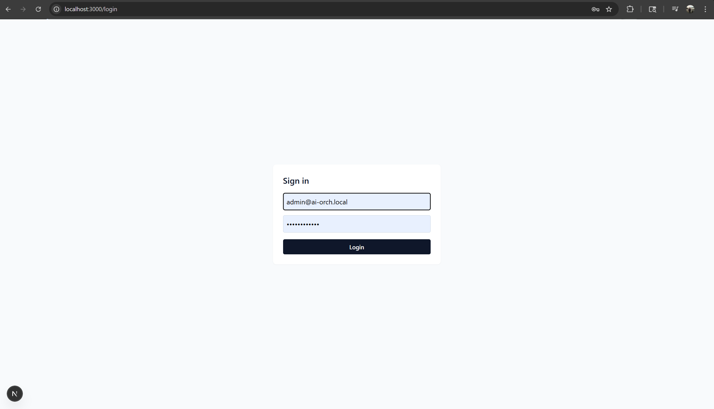

## Admin

### Templates
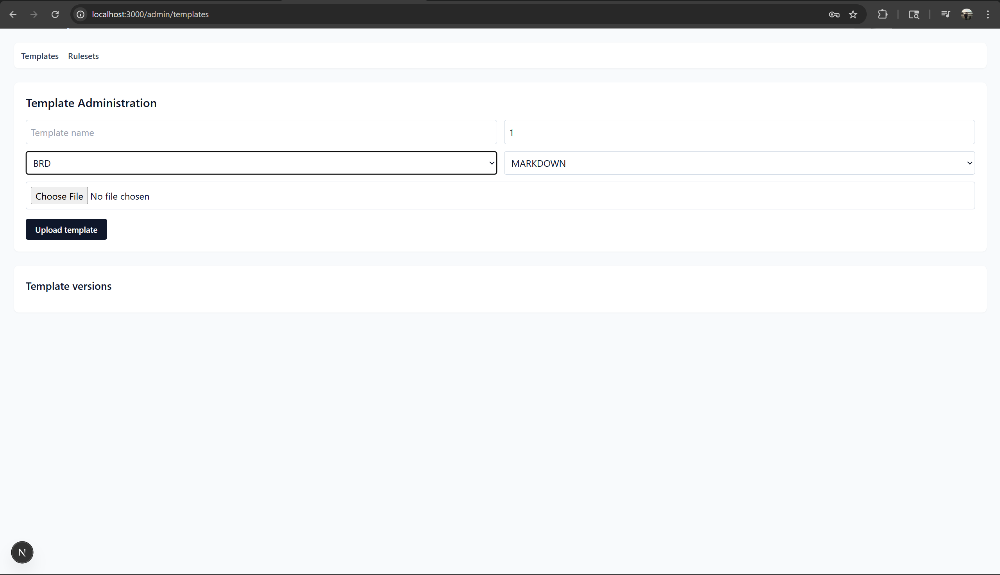

### Template Options
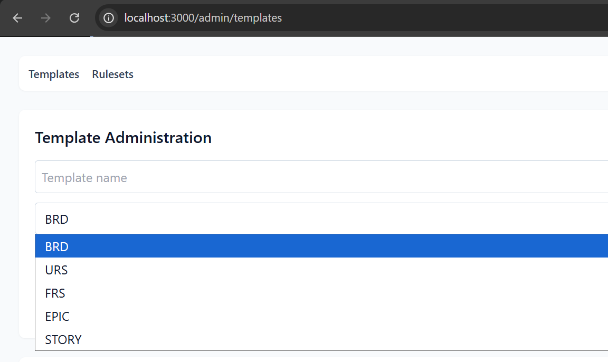

### Ruleset
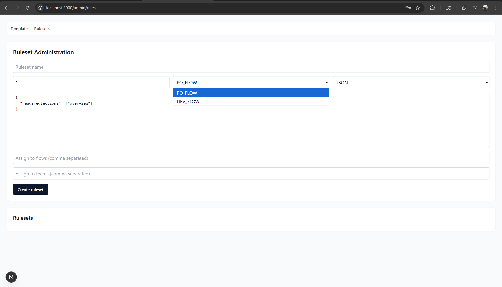

## Business User

### Submit a Request
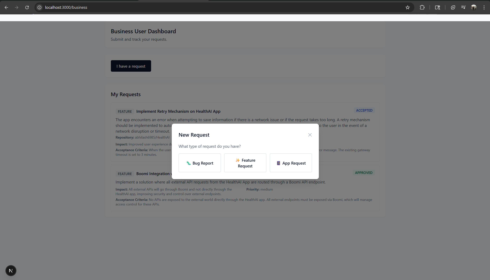

### Request Options
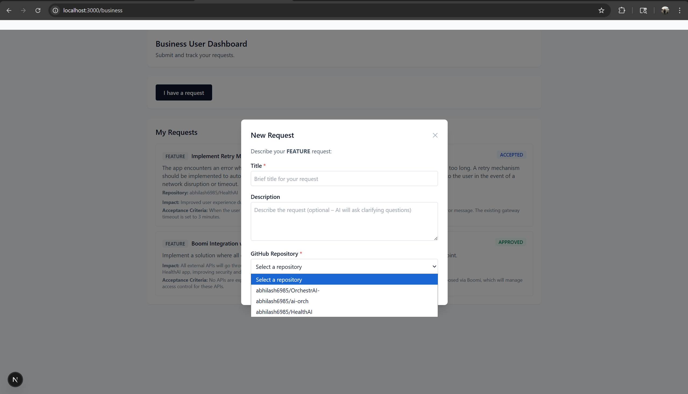

### AI Interview
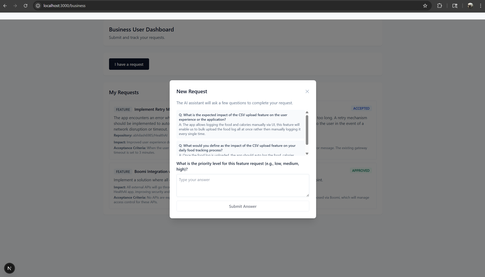

## Product Owner

### List View
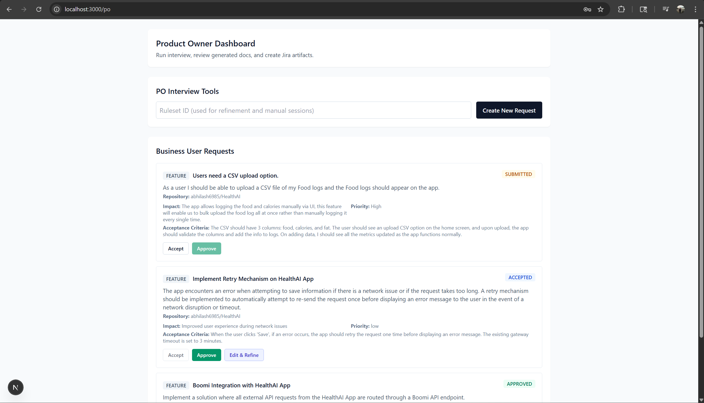

### Review Page
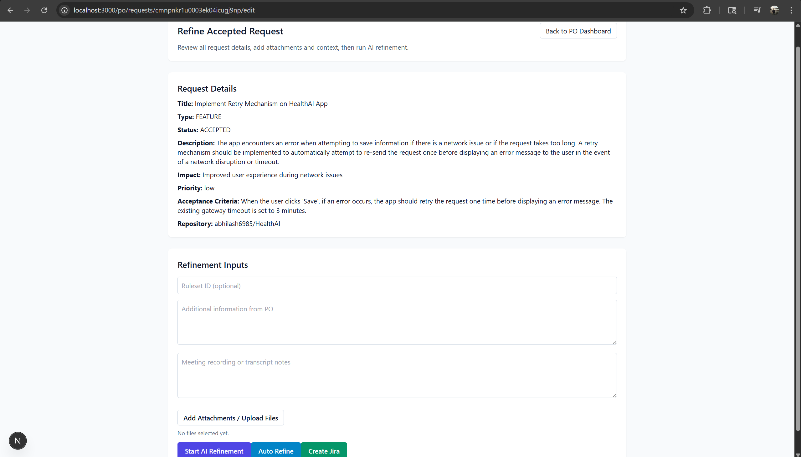

## Developer

### Developer Dashboard
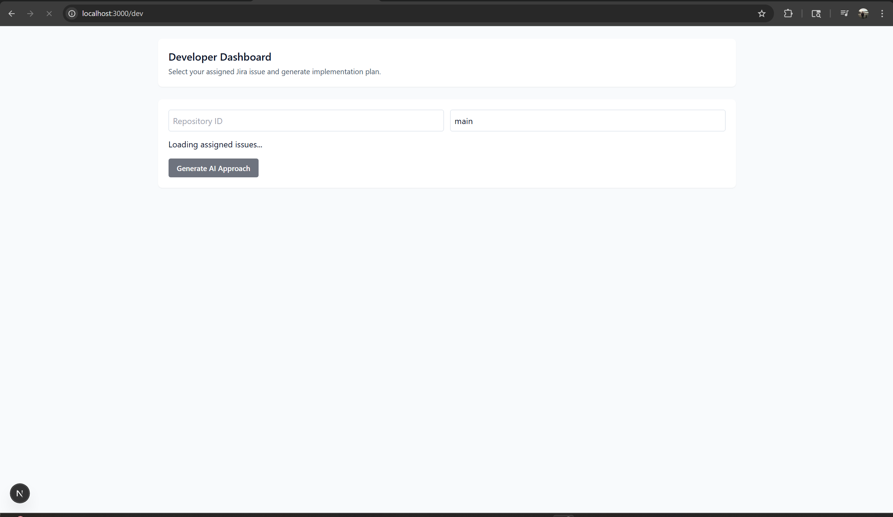

## AI Health
### Screenshot of the mobile App that i built using OrchestrAI
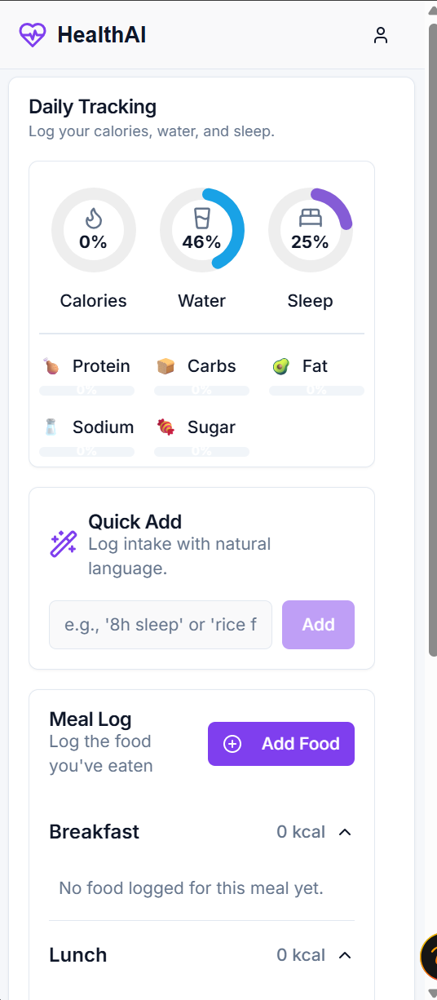


